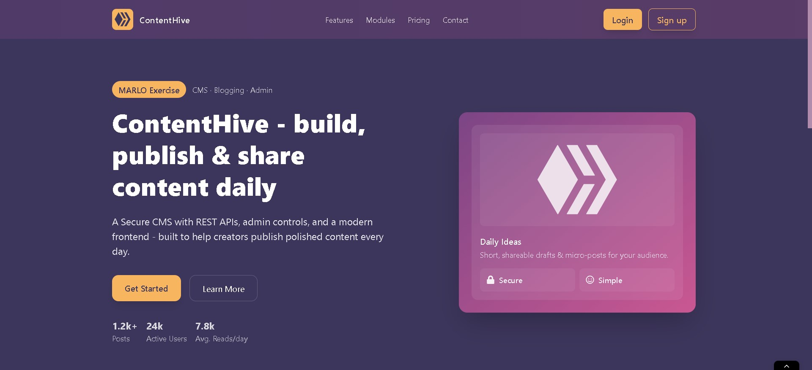

# ContentHive

A simple and scalable CMS platform with **React frontend** and **Django backend**. Publish blogs, read posts, like/unlike, and add comments with secure JWT authentication.

<p align="center">
  
</p>

<p align="center">
  <a href="https://contenthive.agriflow.space" target="_blank">
    
  </a>
  &nbsp;
  <a href="#" target="_blank">
    
  </a>
  &nbsp;
  <a href="https://www.linkedin.com/posts/vishnu-cheruvakkara-231b8b235_contenthive-react-django-activity-7405247809018531840-ks-B?utm_source=share&utm_medium=member_desktop&rcm=ACoAADq6p4UB7yZEvBWQ6nbkRJlURS5jqlFv_yI" target="_blank">
    
  </a>
</p>

---

## 📌 Table of Contents

- [Features](#features)
- [Technologies Used](#technologies-used)
- [Backend Setup](#backend-setup)
- [Frontend Setup](#frontend-setup)
- [Admin Features](#admin-features)
- [User Features](#user-features)
- [Contributing](#contributing)
- [License](#license)

---

## 🚀 Features

- JWT-based secure authentication
- Blog post create/update/delete
- Image upload via Cloudinary
- File storage via Supabase
- Like/unlike system
- User comments with admin approval
- Fully responsive UI

---

## 🛠️ Technologies Used

**Backend:** Django, Django REST Framework, JWT, PostgreSQL, Cloudinary, Supabase

**Frontend:** React, Axios, React Router, Tailwind CSS

---

## 🔧 Backend Setup

### Clone & Install

```bash
git clone https://github.com/VishnuCheruvakkara/ContentHive.git
cd ContentHive/backend
```

### Create Virtual Environment

```bash
python -m venv env

# Windows
env\Scripts\activate

# macOS/Linux
source env/bin/activate
```

### Install Dependencies & Setup

```bash
pip install -r requirements.txt
```

### Environment Variables

Rename `.env.example` to `.env` and add your values:

```bash
mv .env.example .env
```

### Database & Run

```bash
python manage.py migrate
python manage.py createsuperuser
python manage.py runserver
```

Backend: **http://127.0.0.1:8000/**

---

## ⚛️ Frontend Setup

### Install & Run

```bash
cd frontend
npm install
```

### Environment Variables

Rename `.env.example` to `.env` and add your values:

```bash
mv .env.example .env
```

### Start Dev Server

```bash
npm run dev
```

Frontend: **http://localhost:5173/**

---

## 🔐 Admin Features

- Manage users, posts, and comments
- Approve/block comments
- Upload images & files
- Cloud storage integration

---

## 📝 User Features

- View all blog posts
- Read full blogs
- Leave comments
- Like/unlike posts
- Track view counts

---

## 🤝 Contributing

1. Fork the repo
2. Create a branch (`git checkout -b feature/your-feature`)
3. Commit changes (`git commit -m 'Add feature'`)
4. Push (`git push origin feature/your-feature`)
5. Open a PR

---

## 📄 License

Open for educational and development use.

---
